# openLooKeng社区 Issue与Pull Request（PR）提交指南

## 1.Issue创建指南
发现并提交问题，是对社区良好的贡献方式之一。

本文详细描述如何提交一个良好的问题。

### 1.1 Issue简介
+ **名词解释**：Issue是指一项待完成的工作，这个工作可以是“问题”、“事务”、“需求“和”建议“等。每一个Issue都包含该工作的所有信息和历史，便于后来的人了解该项工作的所有方面和过程。因此，在提交Issue时请尽可能将其描述清楚，以方便社区活动的参与。建议参考以下格式：
    - 这是Bug还是功能请求？ 
    - 你做了什么？ 
    - 发生什么事了？或者您认为将带来什么影响？      
    - 如何再现该问题的产生？（尽可能少和精确） 
    - 还有什么我们需要知道的吗？比如环境与条件

+ **来源和作用：** Issue的概念起源于客服部门，用户打电话反馈问题，客服就创建一个工单（ticket），后继每一个处理步骤、每一次和用户的交流都要更新到工单内，记录全部的过程信息，这就是Issue的前身。随着后来的不断扩展，逐步演变成制定和实施软件开发计划的全功能项目管理工具。
+ openLooKeng社区采用Gitee / Github提供的Issue跟踪和管理系统。
+ 图为社区Issue列表，您可以查看或领取感兴趣的Issue（任务），也可以根据下方指南创建新的Issue
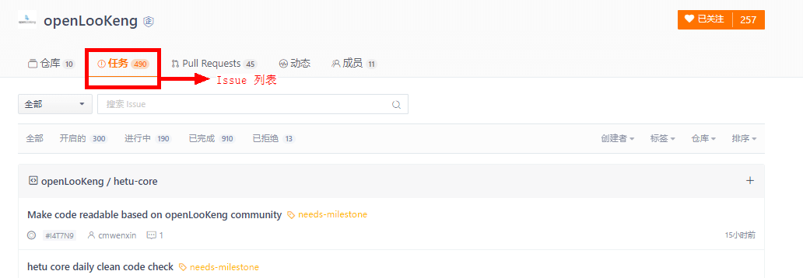

### 1.2 Issue面板
Gitee / Github的每一个Repository内都有一个Issue面板

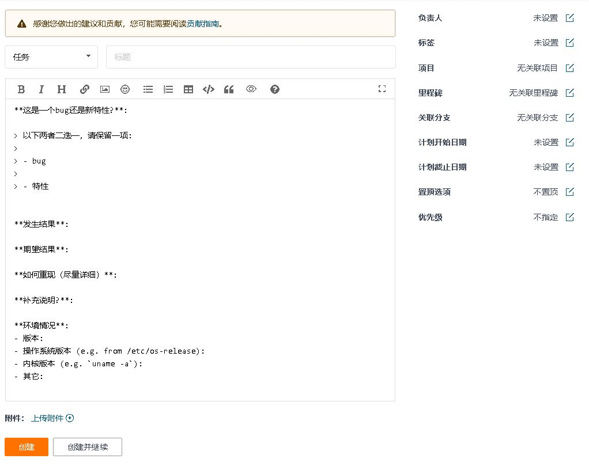

左侧填入Issue的标题和内容，右侧是几个可选配置项。下面简单介绍这些配置项的用法。

+ **名词解释** 用于从当前repository的所有成员内指派对该Issue的处理人员，包括负责人和协作者。
+ **标签：** 可以给该Issue贴上标签，便于对Issue进行分类管理和过滤筛选。
+ **项目：** 可以给该Issue关联项目。
+ **里程碑：** 相关的Issue可以放到一个里程碑里。里程碑通常可以理解为不同的版本或不同的迭代。
+ **关联分支：** 可以指明Issue针对的是哪个分支
+ **计划开始/截止日期：** 可以给该Issue指明期望的计划开始和截止日期，便于领取任务的人参考。
+ **置顶选项：** 可以选择是否让该Issue放置到Issue列表的顶部，以便于吸引大家的关注。
+ **优先级：** 可以给Issue置顶优先级。

### 1.3 确认Issue所属的仓库

如果您能够确定问题归属于哪一个仓库，请在openLooKeng代码仓主页的搜索栏内找到该仓库。
如果您不能确定问题归属，请在“community”仓库内提Issue。
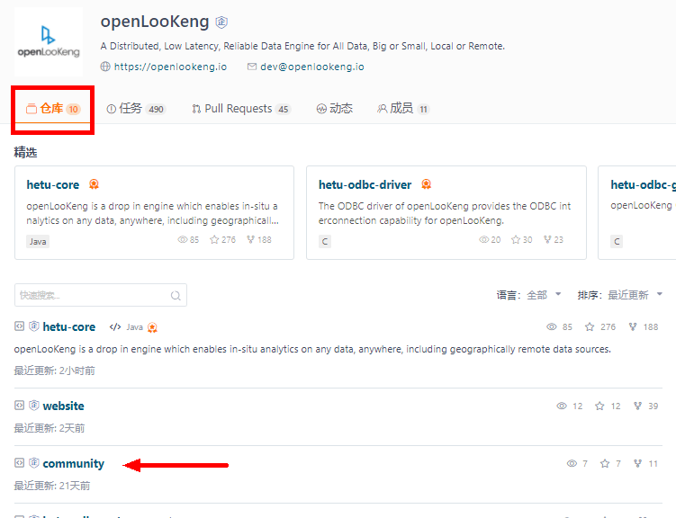

### 1.4 创建一个新的Issue
1. 进入需求对应的团队或项目的仓库后，在工具栏内点击“Issue”，再点击创建“+新建Issue”按钮。
2. 请在标题栏的单选下拉框设置Issue类型，系统会自动为您调出相应的模板。
3. 在标题栏填写您的Issue主题，比如关于某些特性的体验问题、关于什么的需求等。
4. 请在详细说明框内描述该Issue的要点，包括需求、问题的现象、影响、场景和价值等。。

**注意：** 清晰完整的描述有助于团队成员理解，并更快的接受和排入开发计划。


### 1.5 提交并配合Issue处理

您提交Issue后，如果Issue的描述与复现步骤清晰明确、可定位，会有人直接定位并解决该问题。但也有可能会出现，负责跟进该问题的开发者需要您提供更加详细的信息的情况，对此，社区也感谢您的配合与帮助。

## 2 如何提交您的Pull Request（PR）
当您提交一个PR的时候，就意味您已经开始向社区贡献代码了。如果您是一个初学者，并期望这个项目为您打开开源世界的大门，本教程是您的最佳选择之一。只要遵循指导，您将会发现成为一个贡献者的乐趣。

温馨提示：创建PR时，需要贴上关联的Issue链接或编码（参考以下步骤7和8），以方便社区committer和其他参与人对该PR的跟踪和审核工作。

###  2.1 前期准备

**2.1.1 注册Gitee/Github账号** 

openLooKeng社区的代码托管在Gitee和 Github；因此在贡献之前，您需要在Gitee或Github上注册账号。建议以自己私人邮箱进行注册；注册完毕后以该账号登录。

**2.1.2 签署openLooKeng社区贡献者许可协议（CLA）**
+ 进入贡献者许可协议（CLA）页面，根据您参与的身份（个人/企业/员工），使用gitee-id选择签署。
+ 在自己的gitee主页查看个人gitee-id

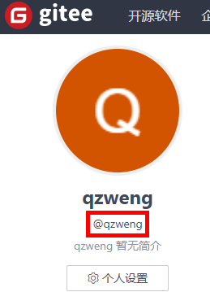

**2.1.3 安装配置工具git**

git是一款优秀的项目版本控制方案，具体介绍请参考git-book 点开起步-安装git进行下载安装

git初始设置
若是第一次使用git命令，则要设置姓名和邮箱（请用英文输入）。
```C
git config --global user.name "your-user-name"
git config --global user.email "your-email-address-on-gitee"
```
注意邮箱地址应与gitee账号的邮箱地址保持一致。


## 3 PR提交指南

### 步骤1：Fork官方代码仓到个人私有仓

进入openLooKeng社区官方代码仓，找到需要的repository（笔者选择的是hetu-core），Fork至个人私有仓。
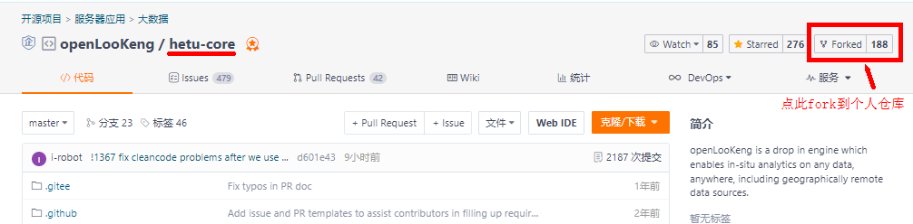

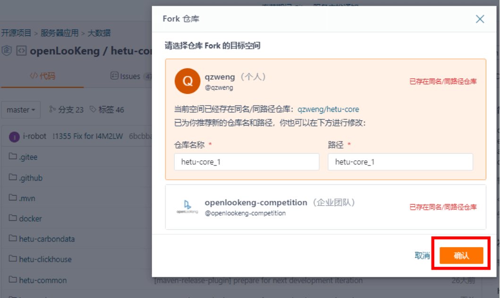

稍等几秒后，官方仓就fork至个人私有仓：

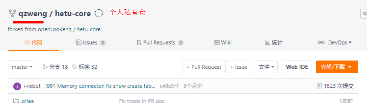

 
### 步骤2：将个人仓库Clone至本地开发环境/本地电脑
1. 先在个人私有仓的页面上拷贝/复制仓库地址

    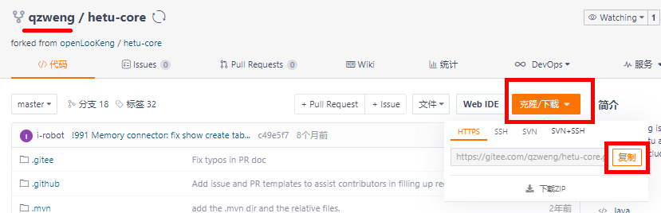

    笔者的个人仓库地址为：https://gitee.com/qzweng/hetu-core.git

2. 在本地电脑新建一个文件夹，鼠标右键打开 `Git Bash` ，输入以下命令Clone 代码：

    ```C
    git clone https://gitee.com/qzweng/hetu-core.git
    ```
    `Clone`完成后，该文件夹内会自动生成新文件夹。以上述仓库地址为例，生成的文件夹为 `hetu-core `


###  步骤3：新增远程上游分支

```C
cd hetu-core
git remote add upstream https://gitee.com/openlookeng/hetu-core.git
git fetch upstream 
```
通过上述命令，进入hetu-core文件夹，并将官方仓库设置为远端分支，以便同步仓库内容；可以通过 `git branch -vva` 命令查看分支情况。 
官方仓地址copy方式和个人仓一样，参考上述第二个命令

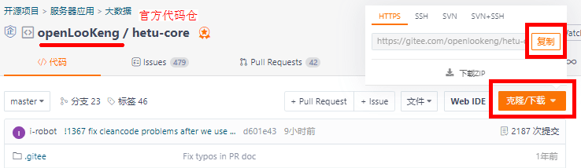

###  步骤4：创建分支

打开文件夹hetu-core，在git Bash继续输入命令，创建分支 ：

```C
git checkout -b new_tt upstream/master
git branch
```
其中 `new_tt` 分支名可以根据自己的情况命名。输入命令 `git branch` 查看当前位于哪个分支。
 

### 步骤5：同步上游分支
```C
git pull --rebase
Already up to date.
```
分支准备好后，您可以开始在本地电脑进行开发。科学命名Markdown文档以及对应的资料，可以有效管理和使用您的资源文件。例如：
20220101-new-year-is-coming.md
20220101-new-year-is-coming-01.png
20220101-new-year-is-coming-02.gif


### 步骤6： 将本地分支的更新推送至远程仓库
当您完成开发任务，并确认无误后，可以在Git Bash内输入以下命令，向社区提交您的成果。

1. 通过git add将您的更新添加到暂缓区，输入git status查看工作目录和暂存区状态。
    ```C
    git add .
    git status
    ```
2. 通过`git commit `将您的更新提交到本地仓库，并在`message`内描述您的commit，输入`git status` 查看工作目录和暂存区状态。 
    ```C 
    git commit -m 'message' 
    git status
    ```
3. Push 代码到自己的远程代码仓。
    ```C
    git push origin new_tt
    git log
    ```
    Push代码的过程中可能需要您再次输入账号和密码。最后需要的话，可以用`git log` 查看日志。

### 步骤7：复制Issue链接
根据前文指南提前创建好Issue，或在已有的列表内找到与您的pr相关联的Issue，点击Issue编码复制链接。

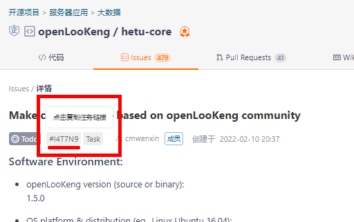


### 步骤8：查看自己的私有仓库并提交PR（Pull Requests）  
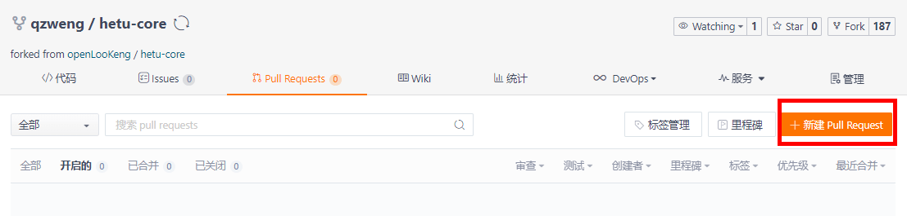

下图为PR创建页面。
首先选择源分支和目标分支。此例中，左侧源分支以 `new_tt` 为例，右侧目标分支保持不变；
其次填写您的PR title（标题），描述本次PR的内容和目的；
然后在具体描述框内贴上相关联的Issue链接，并陈述该PR要解决的问题、方案及原理分析；
最后点击Create完成PR创建。
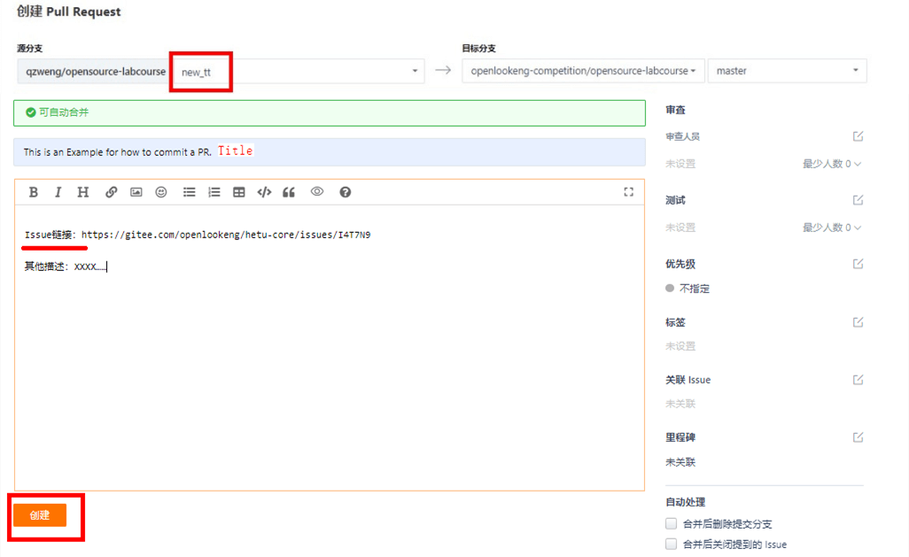


### 步骤9：等待评审与合入，可以在官方仓查看PR提交情况。
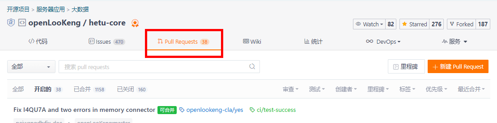

你也可以在相关联的Issue评论区内留言，以便社区其他参与成员查阅。


## 4 参与社区活动

### 4.1 社区内沟通方式说明：
openLooKeng社区的交流方式有邮件列表、Slack交流工具、社区交流群。使用方式请参考社区交流方式指南。

### 4.2 社区新闻和事件
社区每年都会定期举办 PMC例会、Meetup交流会、开发者大会等，这些活动与事件均可以在openLooKeng活动页面上找到。


## 5 交流与反馈
如果您在使用该贡献者指南或对开发过程有疑问，请随时通过告诉我们（邮件列表），并在邮件标题内用“【开发过程疑问】”作为邮件标题写出你的疑问和困惑，openLooKeng社区运营团队会协调人员解答。

其他参考链接：
openLooKeng社区贡献攻略：
https://openlookeng.io/zh-cn/contribution.html

openLooKeng社区博客提交攻略：
https://openlookeng.io/zh-cn/blogguidance.html

openLooKeng社区Bot commands：
https://gitee.com/openlookeng/community/blob/master/command.md


