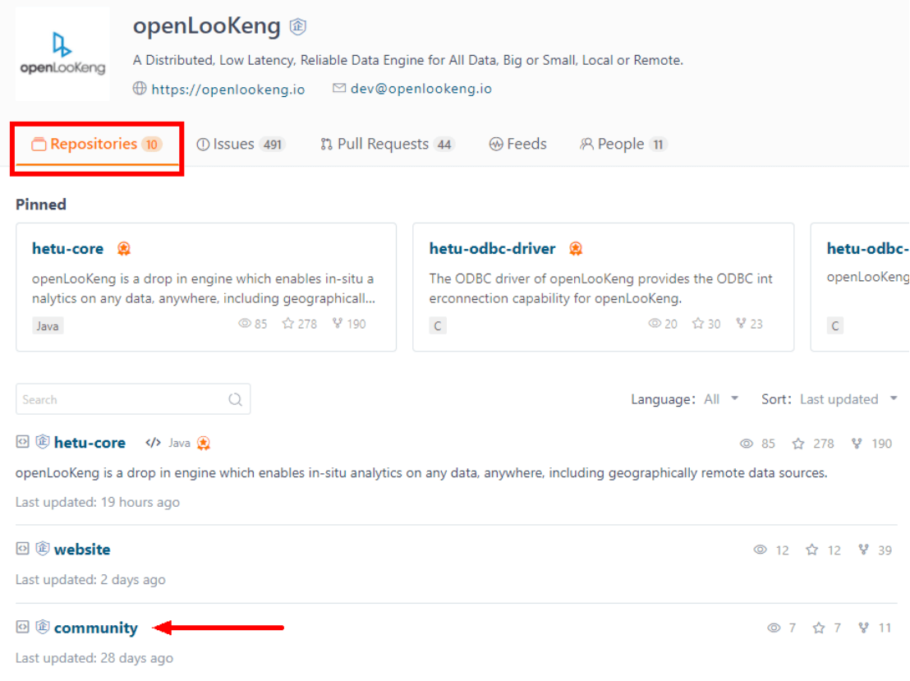
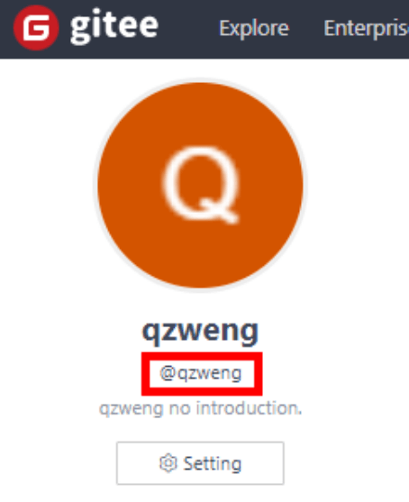
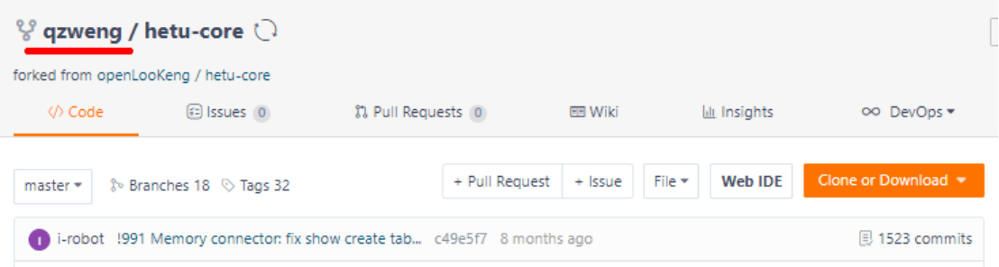
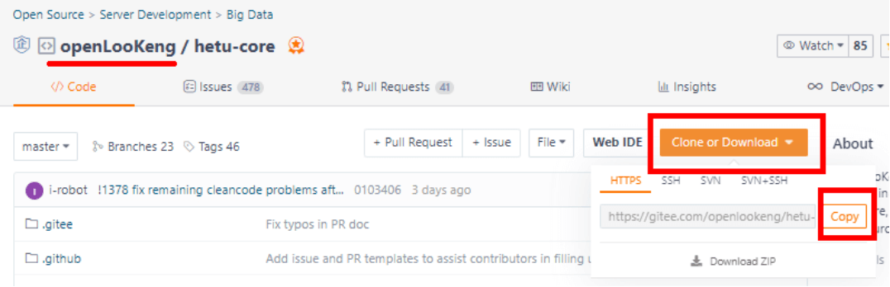
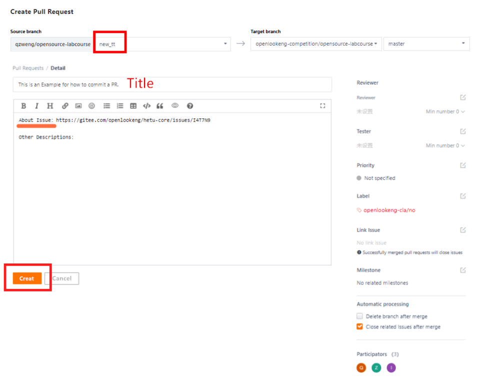

## 1 Creating an Issue
Discovering and submitting issues is one of the good ways to contribute to the community.
This document describes how to write a well-crafted issue.

### 1.1 Issue Introduction
+ **Definition**: An issue refers to a task to be completed. Such task can be a "problem", "transaction", "requirement", and "suggestion". Each issue should contain all the information and history of the task, so that other viewers can understand all the aspects and processes of the task. Therefore, when submitting an issue, describe it as clearly as possible to facilitate collaboration in the community. The following information is recommended to state:
    - Is this a bug or a feature request?
    - What did you do?
    - What happened? Or what do you think will be the impact?
    - How can the issue be reproduced (as concise and accurate as possible)?
    - Is there anything else others need to know? For example, environment and conditions.

+ **Source and function**  The concept of issue originates from the customer service department. When a user makes a call to report a problem, the customer service personnel create a ticket. Each subsequent processing step and each communication with the user need to be updated to the ticket to record all process information. This is the predecessor of the issue. As it expands, the issue evolves into a full-function project management tool for developing and executing software development plans.
+ The openLooKeng community uses the issue tracking and management system provided by Gitee and GitHub.
+ The following figure shows the openLooKeng issue list. You can view or claim issues (tasks) that you are interested in, or create issues according to the following guide.


### 1.2 Issues Page
Each repository of Gitee or GitHub has an Issues page.


Enter the title and content of the issue on the left and configure optional configuration items on the right. The following describes these configuration items.

+ **Definition**: Select the handler of the issue from all members of the current repository, including the owner and collaborator.
+ **Labels**: Add a label to the issue to facilitate issue management and filtering.
+ **Projects**: Associate the issue with a project.
+ **Milestones**: Associate related issues with one milestone. Milestones can usually be understood as different versions or iterations.
+ **Branches**: Specify the branch to which the issue belongs.
+ **Planed to start/Planed to end**: Specify the planned start/end date for the issue for the reference of the person who claims the issue.
+ **Top level**: Choose whether to place the issue on the top of the issue list to attract attention.
+ **Priority**: Specify the priority of the issue.

### 1.3 Repository

If you can determine which repository your issue belongs to, search for the repository on the Repositories page.
If not, submit issues to the community repository.


### 1.4 New Issue
1. Go to the repository of the group or project corresponding to the request, click the Issues tab, and click New issue.
2. Select the issue type from the drop-down list on the title bar. The system will automatically display the corresponding template for you.
3. In the title text box, enter your issue topic, for example, experience problems of some features or specific requests.
4. Describe the key points of the issue in the description text box, including the request, symptom, impact, scenario, and benefits.
 
*Note* : Clear and complete description helps group members understand, accept, and schedule the development plan more quickly.


### Issue Submission and Collaboration

After you submit an issue, if the issue description and reproduction procedure are clear, and the issue can be located, a specific assignee will directly locate and rectify the fault. However, if the assignee needs more detailed information from you, it would be appreciated if you could offer help.

## 2 Submitting a Pull Request (PR)
When you submit a PR, you are starting to contribute code to the community. If you are a beginner and expect this project to usher you into the world of open source, this tutorial is one of your best choices. Just follow the guidelines and you'll find it fun to be a contributor.

Tips: When creating a PR, you need to attach the associated issue link or ID (see steps 7 and 8 below) to the PR so that the community committers and other participants can track and review the PR.

###  2.1 Preparations

**2.1.1 Registering a Gitee/GitHub Account** 

The code of openLooKeng is hosted on Gitee and GitHub. Therefore, you need to register an account with Gitee or GitHub before making contribution. You are advised to use your personal email address to register an account. After the registration is complete, use the account to log in.the repository to the local development

**2.1.2 Signing the openLooKeng CLA**

Go to the Contributor License Agreement page and sign the CLA with your Gitee ID based on your identity (individual/employee/corporation).
View your Gitee ID in your Gitee profile.



**2.1.3 Installing and Configuring Git**

Git is an excellent project version control solution. For details, see the Git Book.
Download and install Git by referring to Getting Started > Installing Git.

**Initial Configuration**

If you use Git for the first time, set your user name and email address.
```C
git config --global user.name "your-user-name"
git config --global user.email "your-email-address-on-gitee"
```
Note that the email address must be the same as that of the Gitee account.


## 3 Creating a PR

### Step 1: Fork the openLooKeng code repository.

Go to the openLooKeng project, find your desired repository (hetu-core for example), and fork the repository.


Wait a few seconds and the repository is successfully forked.



 
### Step 2: Clone the repository to the local development environment or local PC.
1. Copy the repository URL of your fork.

    

    The URL https://gitee.com/qzweng/hetu-core.git is used as an example.

2. Create a working directory on the local PC, right-click the mouse in the working directory and choose Git Bash from the shortcut menu, and run the following command to clone the code:

    ```C
    git clone https://gitee.com/qzweng/hetu-core.git
    ```
    After the clone is complete, a folder, for example, `hetu-core`, is automatically created in the working directory.


###  Step 3: Add a remote upstream repository.

```C
cd hetu-core
git remote add upstream https://gitee.com/openlookeng/hetu-core.git
git fetch upstream 
```
Specify the official public repository as the remote upstream repository that will be synced with your fork. Run `git branch -vva` to list the current configured branches of your fork.

The method of copying the official public repository URL is the same as that of copying the repository URL of your fork.



###  Step 4: Create a branch.

Go to the `hetu-core` folder and run the following commands in Git Bash to create a branch:

```C
git checkout -b new_tt upstream/master
git branch
```
You can specify the branch name as required. The branch name `new_tt` is only an example. Run the `git branch` command to display the current branch.
 

### Step 5:  Sync a fork of a repository to keep it up-to-date with the upstream repository.
```C
git pull --rebase
Already up to date.
```
After the branch is ready, you can start development on the local PC. Properly name Markdown files and other related files for effectively management and use of resource files. Examples:
20220101-new-year-is-coming.md
20220101-new-year-is-coming-01.png
20220101-new-year-is-coming-02.gif


### Step 6: Update the remote branch with local commits.
After completing the development and confirming that the code is correct, you can push your code to the community in Git Bash.

1. Run the `git add` command to add the changes in the working directory to the staging area. Run the `git status` command to display the status of the working directory and the staging area.
    ```C
    git add .
    git status
    ```
2. Save all staged changes along with a brief description (modify message) to the local repository. Run the `git status` command to display the status of the working directory and the staging area.
    ```C 
    git commit -m 'message' 
    git status
    ```
3. Push code to the remote code repository.
    ```C
    git push origin new_tt
    git log
    ```
    You may need to enter the account and password again during code push. Run the `git log` command to view logs if necessary.

### Step 7: Copy the issue link.
Create an issue in advance according to the preceding guide, or find the issue to be associated with your PR in the existing list and click the issue ID to copy the issue link.


### Step 8: Go to the forked repository and create a PR.


The following figure shows the page for creating a PR.
Select the source and target branches. In this example, the source branch on the left is `new_tt`, and the target branch on the right remains unchanged.
Enter the PR title and briefly describe the content and purpose of the PR.
Paste the links to related issues in the description text box, and describe the issues to be resolved, solutions, and principle analysis of the PR.
Click `Create` to create the PR.



### Step 9: Wait for review and merge. You can view the PR status in the official public repository.


You can also leave a message in the comment area of the related issues for other participants to track.


## 4 Participating in Community Activities

### 4.1 Communication Methods in the Community
Community members can communicate with each other through mailing lists, Slack, and community communication groups. For details, see the Communication page.

### 4.2 Community News and Events
The community holds PMC meetings, meetups, and developer conferences every year. These activities and events can be found on the Events page of openLooKeng.


## 5 Communication and Feedback
If you have any questions about the contributor guide or the development process, please feel free to tell us through the mailing lists and write down your questions and doubts in the email with the subject line in the format of "[Questions About the Development Process]". The openLooKeng community operations team will coordinate and assign related personnel to answer your questions.

Other references:
openLooKeng community contribution guide:
https://openlookeng.io/zh-cn/contribution.html

Guidance to Post a Blog:
https://openlookeng.io/zh-cn/blogguidance.html

openLooKeng bot commands:
https://gitee.com/openlookeng/community/blob/master/command.md


